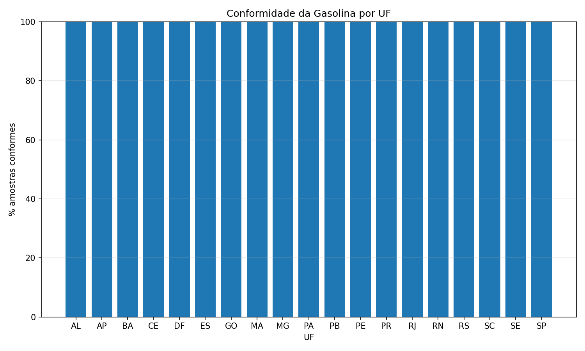
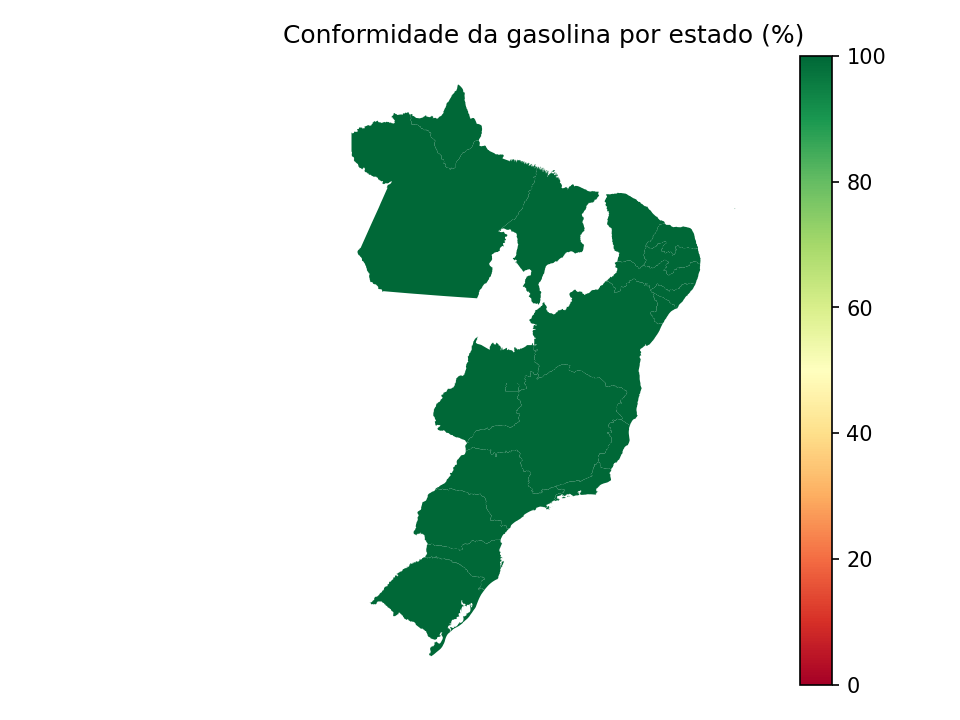
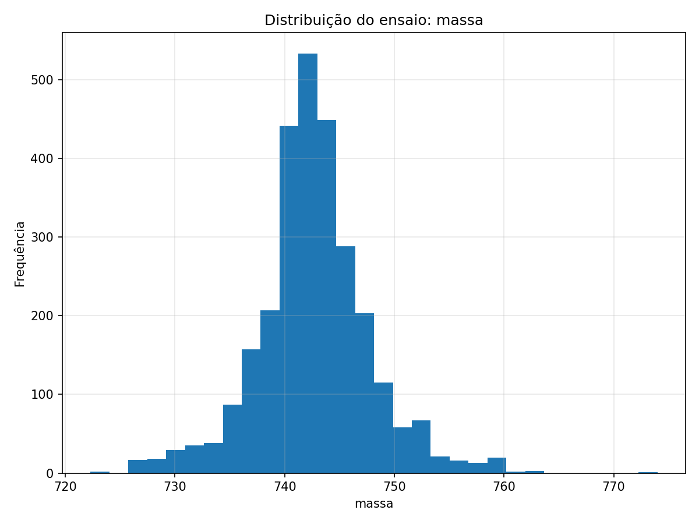
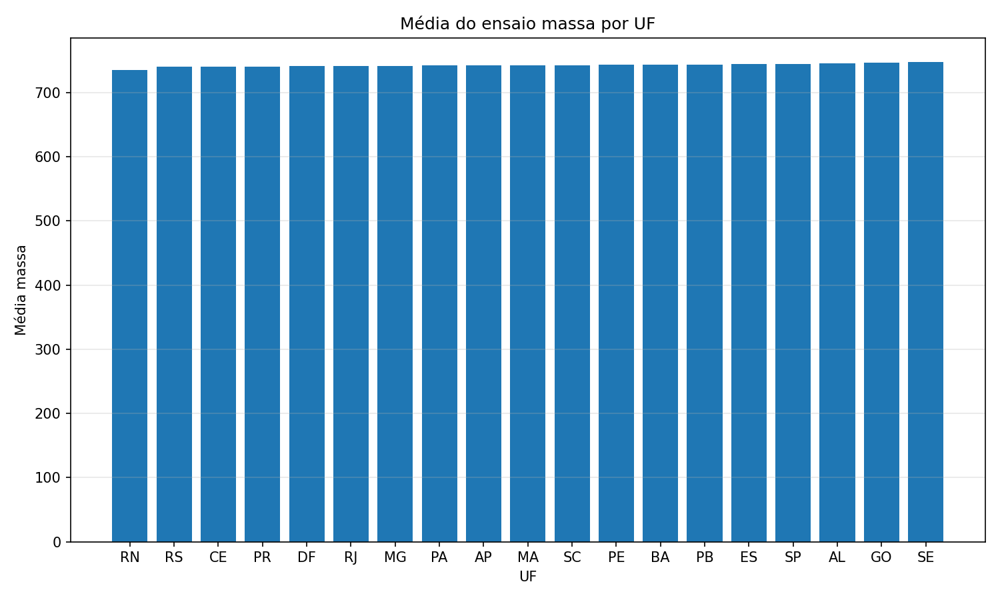
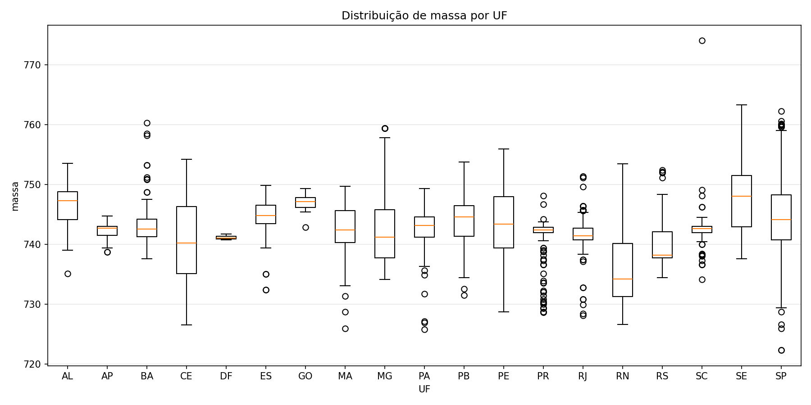

# Análise da Qualidade da Gasolina no Brasil (PMQC)

Análise exploratória da qualidade da gasolina no Brasil utilizando dados do Programa de Monitoramento da Qualidade dos Combustíveis (PMQC) da ANP e ferramentas de ciência de dados em Python.

O objetivo do projeto é realizar uma análise exploratória dos dados públicos do Programa de Monitoramento da Qualidade dos Combustíveis (PMQC), organizando, processando e visualizando informações referentes às amostras de gasolina coletadas em diferentes estados brasileiros.

---

## Base de dados

Os dados utilizados foram obtidos a partir do Programa de Monitoramento da Qualidade dos Combustíveis da Agência Nacional do Petróleo, Gás Natural e Biocombustíveis. Ele encontra-se disponível na pasta data.

Arquivo analisado: pmqc_2025_06.csv

Resumo da base analisada:

| Métrica | Valor |
|-------|------|
Registros totais | 85.447 |
Registros de gasolina | 38.134 |
Registros do ensaio "massa específica" | 2.820 |

Cada linha da base de dados corresponde a um **ensaio laboratorial realizado em uma amostra de combustível**, portanto uma mesma coleta pode gerar vários registros associados a diferentes testes.

---

## Ferramentas utilizadas

- Python
- Pandas
- Matplotlib
- GeoPandas

O script realiza:

1. leitura da base de dados do PMQC
2. filtragem dos registros de gasolina
3. cálculo da conformidade por estado
4. geração de visualizações estatísticas
5. construção de mapa temático do Brasil

---

# Resultados principais

A análise exploratória dos dados permitiu identificar padrões regionais na qualidade da gasolina monitorada pelo PMQC.

## Conformidade da gasolina por estado

O gráfico abaixo apresenta o percentual de amostras conformes em cada unidade federativa.

---

## Mapa de conformidade da gasolina no Brasil

O mapa temático mostra a distribuição geográfica da conformidade da gasolina entre os estados brasileiros.

---

## Distribuição do ensaio de massa específica

O histograma mostra a distribuição dos valores obtidos nas análises laboratoriais.

---

## Média do ensaio de massa específica por estado

Este gráfico apresenta a média dos resultados do ensaio por unidade federativa.

---

## Distribuição por estado (boxplot)

O boxplot permite visualizar:

- mediana
- quartis
- dispersão dos resultados
- possíveis valores atípicos (outliers)

---

## Artigo completo

O relatório completo da análise pode ser acessado aqui:

[Download do artigo em PDF](docs/analise_gasolina_pmqc.pdf)

---

## Conclusão final

Para gasolina, todas as amostras coletadas, dentro das suas respectivas Unidades da Federação, apresentaram conformidade com a legislação em vigor.

## Autor

Matheus Wenner de Lima Santana  
Engenharia Química – Universidade de Brasília
